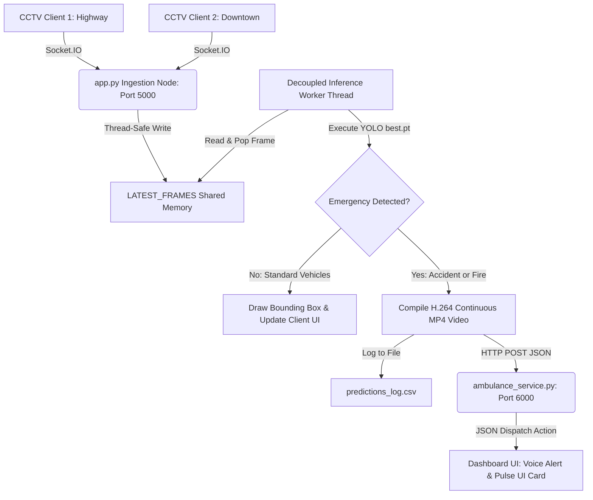

# 🚨 Accivision AI: Real-Time Traffic Accident & Fire Ingestion Engine

Accivision AI is a high-throughput, multi-threaded, and decoupled traffic accident and fire incident detection and autonomous dispatch system. Powered by a custom-trained **YOLOv9** computer vision model (`best.pt`), the system processes live CCTV camera feeds at 30 FPS, detects emergencies with high confidence, logs historical telemetry, records zero-corruption H.264 `.mp4` video clips, and routes immediate emergency response dispatches to a regional microservice.

The futuristic glassmorphic monitoring dashboard utilizes **Socket.IO WebSockets** for low-latency streaming and implements browser-synthesized **autonomous voice announcements** to alert dispatchers instantly when an incident occurs.

---

## 🖥️ Live Dashboard Preview (With Voice Alert)


*Above: Futuristic Accivision AI Dashboard featuring live CCTV video ingestion streams, live emergency bounding boxes, dynamic telemetry cards, automatic dispatch logs, and built-in text-to-speech voice alerts.*

---

## ⚡ Core Features

- **🧠 Custom YOLOv9 Classification**: Uses custom-trained weights (`best.pt`) to precisely distinguish between standard traffic density (e.g. `car`, which are drawn on-screen but ignore dispatches) and emergency scenarios (`accident` and `fire`).
- **🎙️ Real-Time Voice Synthesis Alerts**: Integrates browser-level Text-to-Speech (TTS) alerts that speak immediate audible dispatch details (e.g., *"Warning! Accident detected at Highway-Mile-14. Dispatching ambulance."*) to operators.
- **🛡️ Windows-Native H.264 Recording**: Compiles stream recordings using the Windows Microsoft Media Foundation (MSMF) native H.264 encoder. Saves completely uncorrupted, highly compatible, and natively playable `.mp4` videos under the `output_recordings/` directory with automatic fresh overwriting.
- **🔄 Decoupled Pipeline**: Separates lightweight WebSocket frame ingestion from heavy CPU/GPU YOLO inference via a thread-safe global queueing buffer, maintaining stable 30 FPS ingestion without connection drops.
- **📋 Permanent Audit Logging**: Records a thread-safe historical prediction registry under `predictions_log.csv`, which is parsed on startup to populate dashboard telemetry and past dispatches.
- **🚑 Autonomous Microservice Routing**: Emits instantaneous HTTP REST dispatches downstream to a standalone ambulance service running on Port 6000.

---

## 📐 System Architecture



---

## 🚀 Setup & Execution Guide

Follow these sequential steps to boot the entire multi-service ecosystem:

### 📋 Prerequisites
Ensure you have **Python 3.8+** installed on your system. 

1. Clone or open the project folder:
   ```bash
   cd e:/Accivision
   ```
2. Activate your virtual environment:
   ```powershell
   .venv\Scripts\activate
   ```
3. Install standard requirements (including standard OpenCV, Ultralytics YOLO, and Flask-SocketIO):
   ```bash
   pip install opencv-python ultralytics flask flask-socketio requests eventlet gevent-websocket
   ```

---

### 🏃‍♂️ Running the Services

Always launch the services in the following order to ensure downstream connections bind successfully:

#### **Step 1: Start the Ambulance Dispatch Service (Port 6000)**
Open a terminal and run the mock municipal ambulance microservice:
```bash
python ambulance_service.py
```
*Console output will display:* `[SERVICE] Standalone Emergency Service Active on http://127.0.0.1:6000/alert`

#### **Step 2: Start the Accivision Ingestion & Processing Server (Port 5000)**
Open a second terminal and boot the main Flask-SocketIO AI server:
```bash
python app.py
```
*On launch, the server verifies and loads your custom YOLOv9 model directly from the weights file:*
`[SERVER] Successfully found and loaded custom accident model: NEXUS-AI-FRAMEWORK\best.pt`

#### **Step 3: Access the Live Dashboard**
Open your web browser (Chrome, Edge, or Firefox) and navigate to:
**[http://127.0.0.1:5000](http://127.0.0.1:5000)**
*The dashboard will load instantly, parsed from `predictions_log.csv`, displaying your historical alerts and dispatches.*

#### **Step 4: Launch the Edge CCTV Clients**
Open a third terminal and run the simulator to stream frames to the server:
```bash
python cctv_clients.py
```
*The clients will stream frames, the model will run inference in real-time, the dashboard cards will glow red, dispatches will trigger, and the server will speak voice alerts!*

---

## 📁 Output Artifacts
Once a client finishes streaming, it emits a clean disconnect signal. You can locate your processed files directly under:
* **`output_recordings/CAM-NORTH-01_output.mp4`**: Fully uncorrupted, H.264 encoded video of the Highway stream with annotated bounding boxes.
* **`output_recordings/CAM-DOWN-02_output.mp4`**: Fully uncorrupted, H.264 encoded video of the Downtown stream with annotated bounding boxes.
* **`predictions_log.csv`**: A CSV sheet auditing all traffic telemetry, detections, confidence scores, and actions.
